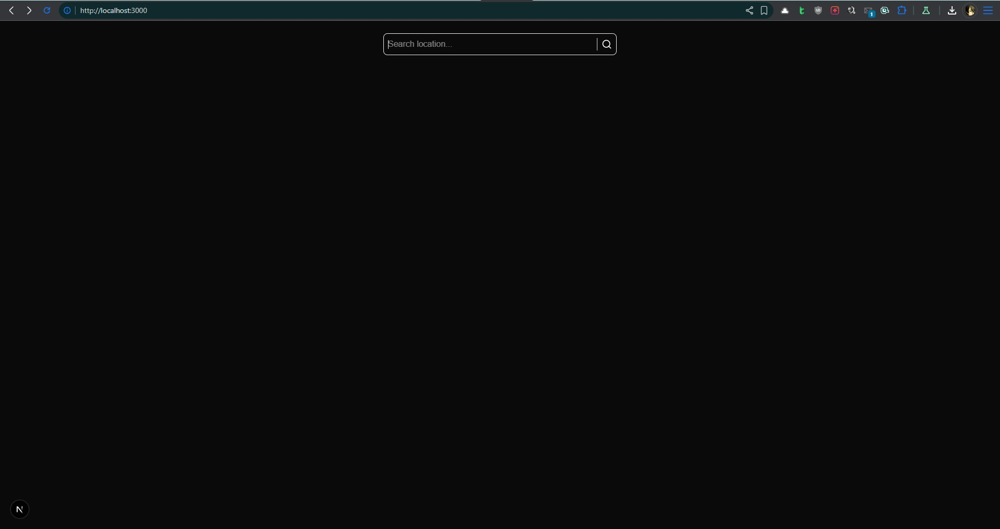
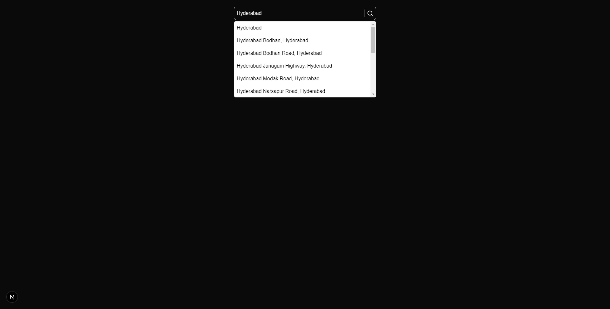

# Real Estate Explorer 🏡

A modern, interactive web application for discovering flats and villas across cities. Designed to make property search seamless and informative, the app combines intuitive search, infinite scrolling, project brochures, and interactive maps.

---

## Features

### 1. **Smart Location Search**

- Type a location on the homepage and get **real-time autosuggestions**.
- Quickly jump to a city and explore available projects.

### 2. **City-wise Project Listing**

- View all **flats and villas** in a city.
- Infinite scroll ensures smooth browsing without page reloads.
- Each project card displays:
  - Project name
  - Builder details
  - Price range
  - Quick links to brochure downloads

### 3. **Downloadable Brochures**

- Download project brochures directly from the listing or project details page.
- Save property information for offline review.

### 4. **Project Details with Interactive Map**

- Each project has a dedicated page.
- **Interactive map** pinpoints the exact location of the project.
- View surrounding landmarks and neighborhoods for better decision-making.

### 5. **Seamless User Experience**

- Responsive design for desktop, tablet, and mobile.
- Smooth infinite scrolling for effortless browsing.
- Clean, modern UI to help users focus on property discovery.

---

## Screenshots

_Search bar_  
  
_Search bar with auto-suggestions_  


_Infinite scroll of city-wise projects_


_Project info with interactive map and brochure download_


[Download Code Explanation](./screenshots/code-explanation.mp4)

[Download Walkthrough](./screenshots/walkthrough.mp4)

---

## Tech Stack

- **Frontend:** Next.js, Tailwind CSS, PositionStack API, Styled Components
- **State Management:** Zustand
- **Maps:** Leaflet.js
- **Deployment:** Vercel

---

🌐 **Demo:** [Visit the live demo](https://magic-bricks-scraper.vercel.app/)

## Installation

```bash
# Clone the repository
git clone https://github.com/reaperhound/magic-bricks-scraper.git
cd magic-bricks-scraper

# Install dependencies
npm install

# Run locally
npm run dev
```
